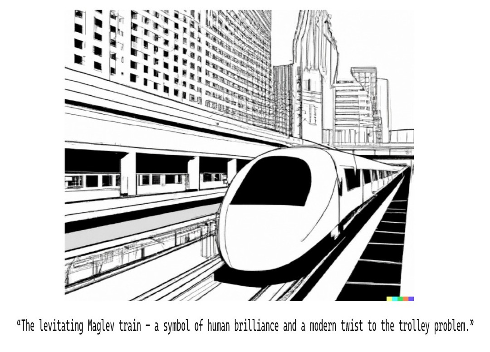

Trolley problems get really interesting with levitating trains. Do we need a new thought experiment? How do we go about creating one? 

I like thinking about how technological influences reshape culture. Similar explorations here [[image33.md|Chivalry and automatic doors]]

