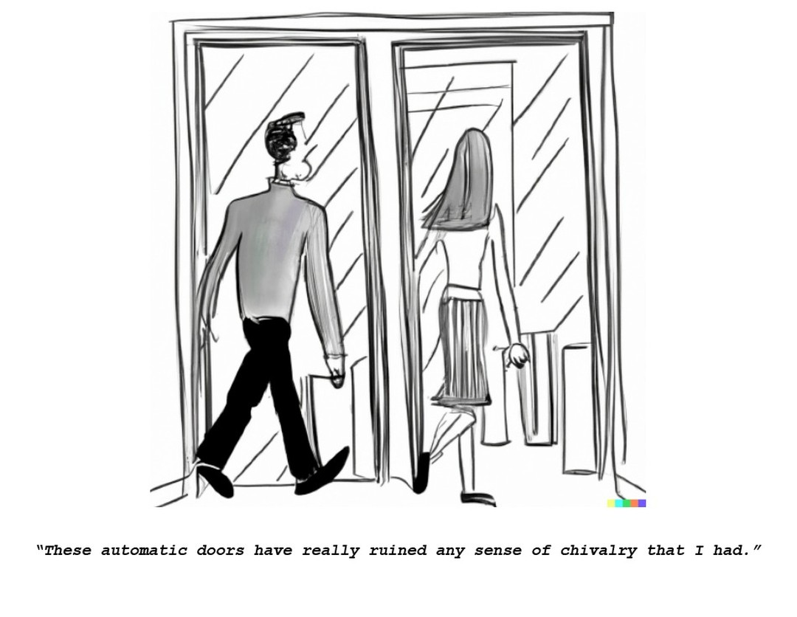

---
title: Chivalry with automatic doors
tags: [meta,technology,dates]
---

I like thinking about how cultural nuances change as technology evolves. Opening doors used to be a common chivalrous act a lot earlier but what happens now that automatic doors are becoming the norm across places? Do we lose out on this act over time, does that have interesting second order effects? 

Similar comics at [[image18.md|Trolley Problem and levitating trains]]

