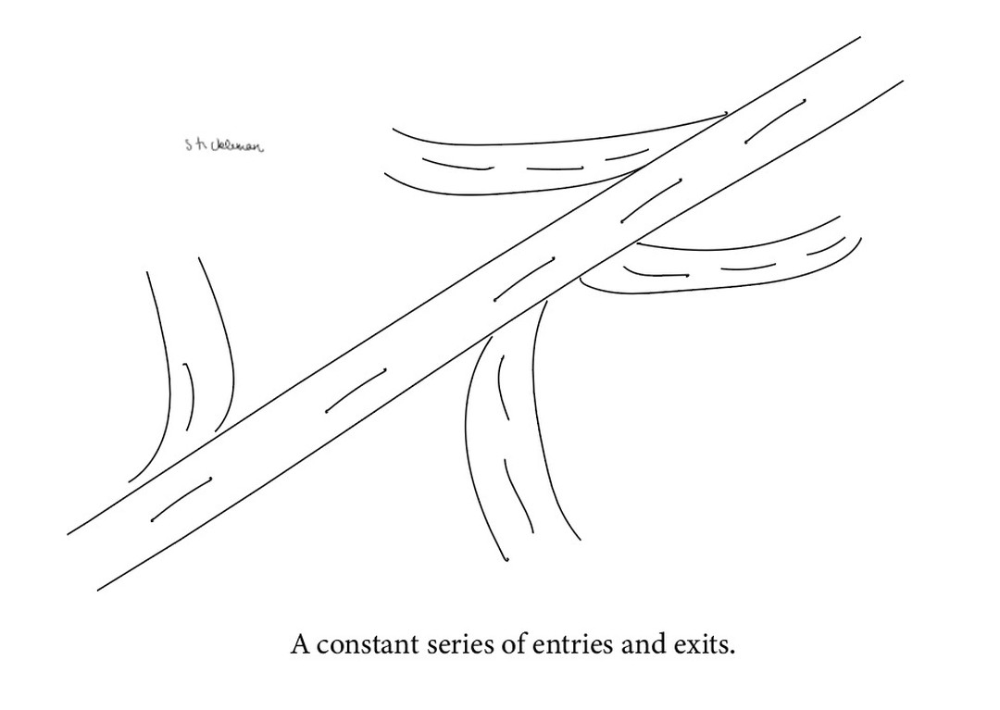

I made this when I was just thinking about how working in Pune and post college in general a lot of my friendships will change due to sheer distance from home. But I will also make new friends and bonds - if only we had more time because clearly we have enough space in our hearts for friendships. 

Tangent - space in heart but time is a comic I've always wanted to make but it's a beautiful concept and I want to do it justice. Hit me up if you ever have any ideas on that!

