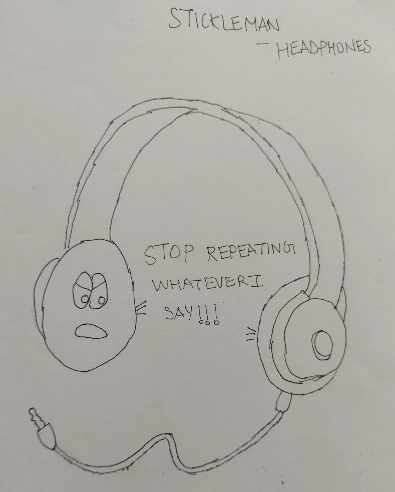

I'm really proud of this comic as it requires me to just think really hard.

A lot of my pieces are mostly observational - just have a funny twist to day to day life and you're sorted. Kinda easy after a while

But pieces like this test my creativity - I really need to think about how I can use the characteristics of an inanimate object and use that to come up with something interesting. 

Related attempts - [[image40.md|Protactors]] [[image41.md|Clips]] [[image175.md|Suitcases]]
[[image176.md|D for Depth]]

[[https://harshj.substack.com/p/balance-between-images-and-text-in|Tangent on how comics are just video games that get harder]]

